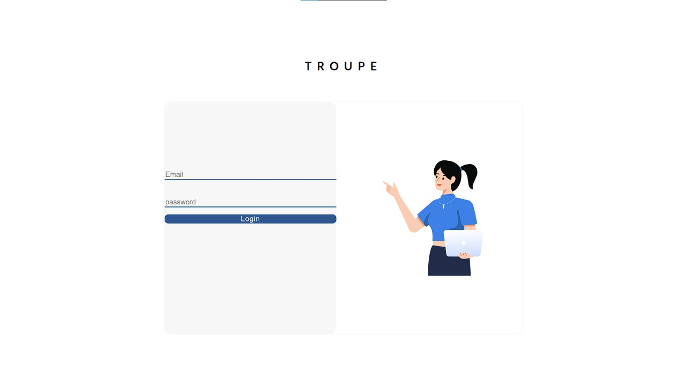
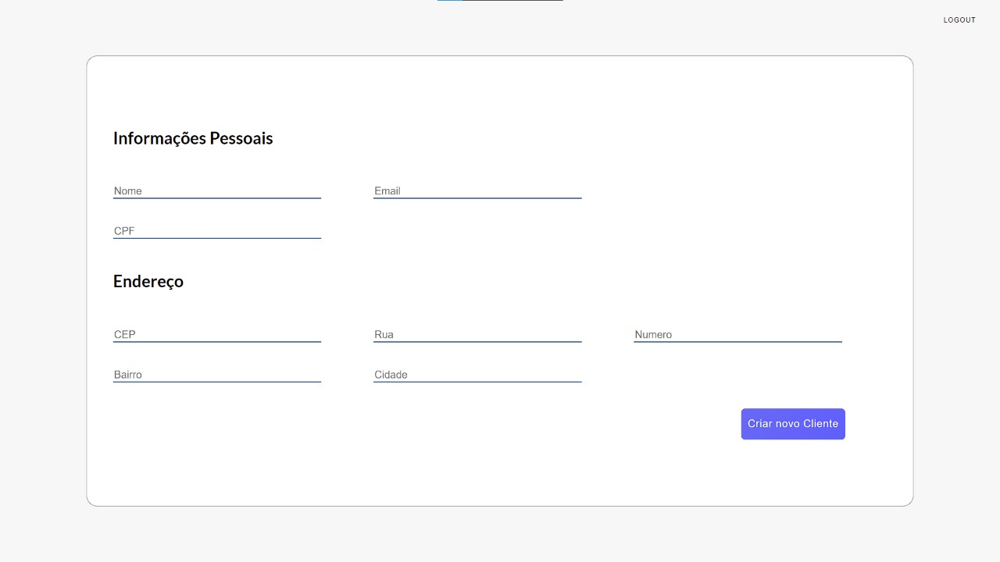
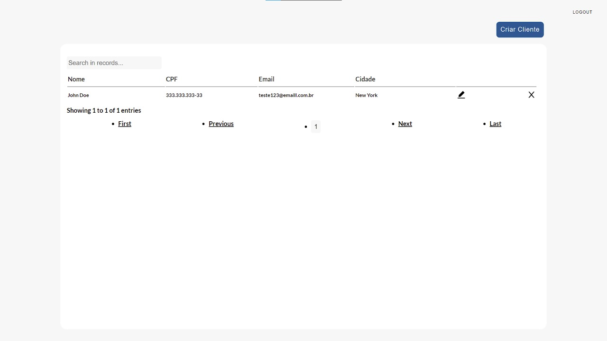
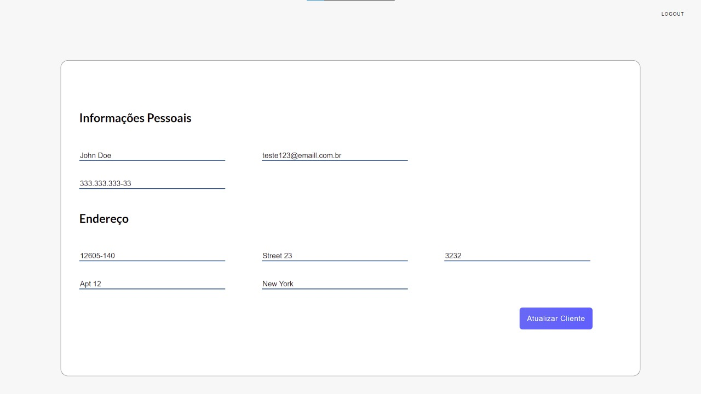

# Troupe-Teste

Project made using React and JSON-Server that allows login and Projeto feito em React que permite o login e a criação de clientes utilizando JSON-Server.  

## Features

+ Login
+ Logout
+ Create Client
+ List Client
+ Update Client
+ Delete Client
+ Redirect route
+ Not found route

## Technologies


+ React
+ Typescript
+ JSON-Server
+ React Toastify
+ Cypress

## Libraries

+ axios
+ React Router Dom
+ JSON-Server
+ Styled-components
+ Prettier
+ formik
+ Yup


## How to start

+ Clone the Repository
+ yarn

+ yarn backend
+ yarn start

Login:
```
"email": "teste@emaill.com.br",
"password": "123456",
```


## Project Images

### Login




### Create Client

  

### Client Table 



### Update Client


